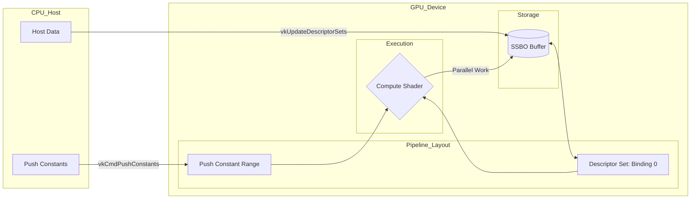

# Graphics Research Tools

## 1. 사용 방법

```bash
# 빌드
cmake --build build

# 실행
./build/Vision3D
```

## 2. 어플리케이션 구조

- 해당 Vulkan pipeline은 다음과 같이 구성한다.

```bash
  ┌─────────────────────────────────────────────────────────────────┐
  │                           main.cpp                              │
  │  app.addFeature(TriangleFeature)                                │
  │  app.addFeature(BlinnPhongFeature)   →  features_[] 에 등록     │
  │  app.addFeature(ComputeTest)                                    │
  └──────────────────────────┬──────────────────────────────────────┘
                             │ app.run()
                             ▼
  ┌─────────────────────────────────────────────────────────────────┐
  │                       Application::run()                        │
  │                                                                 │
  │  initWindow()  →  initVulkan()  →  initImGui()                  │
  │                                                                 │
  │  for (auto& f : features_)                                      │
  │      f->onInit(makeContext())   ◄── VulkanContext 전달           │
  │                                                                 │
  │  mainLoop()                                                     │
  │                                                                 │
  │  vkDeviceWaitIdle()                                             │
  │  for (auto& f : features_)                                      │
  │      f->onCleanup()                                             │
  └──────────────────────────┬──────────────────────────────────────┘
                             │
                             ▼
  ┌─────────────────────────────────────────────────────────────────┐
  │                     mainLoop()  (매 프레임)                      │
  │                                                                 │
  │  glfwPollEvents()  →  drawFrame()                               │
  └──────────────────────────┬──────────────────────────────────────┘
                             │
                             ▼
  ┌─────────────────────────────────────────────────────────────────┐
  │                        drawFrame()                              │
  │                                                                 │
  │  ① ImGui::NewFrame()                                            │
  │                                                                 │
  │  ② Feature 선택 패널 그리기 (버튼 1~9)                           │
  │       activeFeature_ 변경 가능                                   │
  │                                                                 │
  │  ③ features_[activeFeature_]->onImGui()                         │
  │                                                                 │
  │  ④ ImGui::Render()                                              │
  │                                                                 │
  │  ⑤ vkAcquireNextImageKHR()                                      │
  │                                                                 │
  │  ⑥ recordCommandBuffer()  ──────────────────────────────────┐   │
  │                                                             │   │
  │  ⑦ vkQueueSubmit()  →  vkQueuePresentKHR()                  │   │
  └─────────────────────────────────────────────────────────────┼───┘
                                                                │
                             ┌──────────────────────────────────┘
                             ▼
  ┌─────────────────────────────────────────────────────────────────┐
  │                   recordCommandBuffer()                         │
  │                                                                 │
  │  vkBeginCommandBuffer()                                         │
  │                                                                 │
  │  features_[active]->onCompute(cmd)  ◄── 렌더패스 시작 전        │
  │          │                               (compute shader용)     │
  │          ▼                                                      │
  │  vkCmdBeginRenderPass()                                         │
  │                                                                 │
  │  features_[active]->onRender(RenderContext{cmd, imageIndex})    │
  │                                                                 │
  │  ImGui_ImplVulkan_RenderDrawData()                              │
  │                                                                 │
  │  vkCmdEndRenderPass()  →  vkEndCommandBuffer()                  │
  └─────────────────────────────────────────────────────────────────┘

  ┌─────────────────────────────────────────────────────────────────┐
  │               키 입력 (GLFW 콜백)                                │
  │                                                                 │
  │  keyCallback()                                                  │
  │    ├─ ESC              →  window close                          │
  │    ├─ 1~9             →  activeFeature_ 변경                    │
  │    └─ 나머지           →  features_[active]->onKey(key,action)  │
  └─────────────────────────────────────────────────────────────────┘

  ┌─────────────────────────────────────────────────────────────────┐
  │                    IFeature (인터페이스)                         │
  │                                                                 │
  │  onInit(VulkanContext)   파이프라인·버퍼·디스크립터 생성         │
  │  onCompute(cmd)          compute dispatch (optional)            │
  │  onRender(RenderContext) draw call 기록                         │
  │  onImGui()               패널 UI (optional)                     │
  │  onKey(key,action,mods)  키 처리 (optional)                     │
  │  onCleanup()             Vulkan 리소스 해제                      │
  │                                                                 │
  │    ▲              ▲                   ▲                         │
  │    │              │                   │                         │
  │ Triangle    BlinnPhong           ComputeTest                    │
  │ Feature      Feature          (compute_wave)                    │
  └─────────────────────────────────────────────────────────────────┘
```

## 3. Vulkan Graphics Pipeline


